## Advanced Modeling

The content of the class handles the cases when the basic assumptions of regression break.

- [Penalized Regression](https://github.com/NCSU-Analytics/advanced_modeling/blob/master/advanced_modeling_notes.md#penalized-regression)
- [Biased Regression Techniques](https://github.com/NCSU-Analytics/advanced_modeling/blob/master/advanced_modeling_notes.md#biased-regression-techniques)
- [Approaches](https://github.com/NCSU-Analytics/advanced_modeling/blob/master/advanced_modeling_notes.md#approaches)
- [Principal Components Regression](https://github.com/NCSU-Analytics/advanced_modeling/blob/master/advanced_modeling_notes.md#principal-components-regression)
- [Interpretation](https://github.com/NCSU-Analytics/advanced_modeling/blob/master/advanced_modeling_notes.md#interpretation)
- [Cautions with PCR](https://github.com/NCSU-Analytics/advanced_modeling/blob/master/advanced_modeling_notes.md#cautions-with-pcr)
- [Ridge Regression](https://github.com/NCSU-Analytics/advanced_modeling/blob/master/advanced_modeling_notes.md#ridge-regression)
- [The Fixed Point Method](https://github.com/NCSU-Analytics/advanced_modeling/blob/master/advanced_modeling_notes.md#the-fixed-point-method)
- [The Iterative Method](https://github.com/NCSU-Analytics/advanced_modeling/blob/master/advanced_modeling_notes.md#the-iterative-method)
- [The Ridge Trace](https://github.com/NCSU-Analytics/advanced_modeling/blob/master/advanced_modeling_notes.md#the-ridge-trace)
- [Cautions with Ridge Regression](https://github.com/NCSU-Analytics/advanced_modeling/blob/master/advanced_modeling_notes.md#cautions-with-ridge-regression)
- [Ridge Regression R Code](https://github.com/NCSU-Analytics/advanced_modeling/blob/master/advanced_modeling_notes.md#relevant-r-code)
- [Instrumental Variables](https://github.com/NCSU-Analytics/advanced_modeling/blob/master/advanced_modeling_notes.md#instrumental-variables)
- [Omitted Variable Bias](https://github.com/NCSU-Analytics/advanced_modeling/blob/master/advanced_modeling_notes.md#omitted-variable-bias)
- [Measurement Error](https://github.com/NCSU-Analytics/advanced_modeling/blob/master/advanced_modeling_notes.md#measurement-error)
- [Solutions](https://github.com/NCSU-Analytics/advanced_modeling/blob/master/advanced_modeling_notes.md#solutions)
- [Instrumental Variables and 2SLS](https://github.com/NCSU-Analytics/advanced_modeling/blob/master/advanced_modeling_notes.md#instrumental-variables-and-2sls)
- [2 Stage Least Squares in SAS](https://github.com/NCSU-Analytics/advanced_modeling/blob/master/advanced_modeling_notes.md#2sls-in-sas)
- [Test of Endogeneity](https://github.com/NCSU-Analytics/advanced_modeling/blob/master/advanced_modeling_notes.md#test-of-endogeneity)
- [Test of Overspecification](https://github.com/NCSU-Analytics/advanced_modeling/blob/master/advanced_modeling_notes.md#test-of-overspecification)
- [Simultaneous Equations](https://github.com/NCSU-Analytics/advanced_modeling/blob/master/advanced_modeling_notes.md#simultaneous-equations)
- [Estimating Parameters in Simultaneous Equations](https://github.com/NCSU-Analytics/advanced_modeling/blob/master/advanced_modeling_notes.md#estimating-parameters-in-simultaneous-equations)
- [Heteroscedasticity and Weighted Least Squares](https://github.com/NCSU-Analytics/advanced_modeling/blob/master/advanced_modeling_notes.md#heteroscedasticity-and-weighted-least-squares-wls)
- [Accounting for Heteroscedasticity](https://github.com/NCSU-Analytics/advanced_modeling/blob/master/advanced_modeling_notes.md#accounting-for-heteroscedasticity)
- [White's General Test](https://github.com/NCSU-Analytics/advanced_modeling/blob/master/advanced_modeling_notes.md#whites-general-test)
- [Breusch-Pagan Test](https://github.com/NCSU-Analytics/advanced_modeling/blob/master/advanced_modeling_notes.md#breusch-pagan-test)
- [Example with Credit Card Expenses Data](https://github.com/NCSU-Analytics/advanced_modeling/blob/master/advanced_modeling_notes.md#example-with-credit-card-expenses-data)
- [Addressing Heteroscedasticity Problems - Robust Standard Errors](https://github.com/NCSU-Analytics/advanced_modeling/blob/master/advanced_modeling_notes.md#addressing-heteroscedasticity-problems---robust-standard-errors)
- [Weighted Least Squares](https://github.com/NCSU-Analytics/advanced_modeling/blob/master/advanced_modeling_notes.md#weighted-least-squares)
- [Feasible Generalized Least Squares (FGLS)](https://github.com/NCSU-Analytics/advanced_modeling/blob/master/advanced_modeling_notes.md#feasible-generalized-least-squares-fgls)
- [Robust Regression](https://github.com/NCSU-Analytics/advanced_modeling/blob/master/advanced_modeling_notes.md#robust-regression)
- [Distributional Outliers](https://github.com/NCSU-Analytics/advanced_modeling/blob/master/advanced_modeling_notes.md#distributional-outliers)
- [Huber's M-Estimation](https://github.com/NCSU-Analytics/advanced_modeling/blob/master/advanced_modeling_notes.md#hubers-m-estimation)
- [Least Trimmed Squares (LTS)](https://github.com/NCSU-Analytics/advanced_modeling/blob/master/advanced_modeling_notes.md#least-trimmed-squares-lts)
- [S-estimation and MM-estimation](https://github.com/NCSU-Analytics/advanced_modeling/blob/master/advanced_modeling_notes.md#s-estimation-and-mm-estimation)
- [Panel Data](https://github.com/NCSU-Analytics/advanced_modeling/blob/master/advanced_modeling_notes.md#panel-data)
- [Panel Data Model](https://github.com/NCSU-Analytics/advanced_modeling/blob/master/advanced_modeling_notes.md#panel-data-model)
- [Pooled Regression Model](https://github.com/NCSU-Analytics/advanced_modeling/blob/master/advanced_modeling_notes.md#pooled-regression-model)
- [Fixed Effects Model](https://github.com/NCSU-Analytics/advanced_modeling/blob/master/advanced_modeling_notes.md#fixed-effects-model)
- [Least Squares Dummy Variable (LSDV) Approach](https://github.com/NCSU-Analytics/advanced_modeling/blob/master/advanced_modeling_notes.md#least-squares-dummy-variable-lsdv-approach)
- [Time Fixed Effect](https://github.com/NCSU-Analytics/advanced_modeling/blob/master/advanced_modeling_notes.md#time-fixed-effect)
- [Two-way Fixed Effects Model](https://github.com/NCSU-Analytics/advanced_modeling/blob/master/advanced_modeling_notes.md#two-way-fixed-effects-model)
- [Random Effects Model](https://github.com/NCSU-Analytics/advanced_modeling/blob/master/advanced_modeling_notes.md#random-effects-model)
- 

----

### Penalized Regression

The idea all deals with multicollinearity. In the past, we've dropped variables and centered things. Sometimes, we can't drop or center.

**Multicollinearity**
- Occurs when two or more of the explanatory variables in a regression model are **highly** correlated with each other
- This correlation results in inflated standard errors on the regression coefficients.
- Can potentially switch the expected sign of a regression coefficient.

This does not affect predictions, but the models are funny and won't present well. The models that do not make intuitive sense are problematic when it comes to explanation.

*Dealing with Multicollinearity*
- Exclude redundant independent variables
- Redefine variables
- Use biased regression techniques
- Center the independent variable in polynomial models.

#### Biased Regression Techniques

- Biased regression techniques intentionally bias the estimation of the regression coefficients.
- Although these methods produce estimates that are biased, they tend to have more precision than OLS estimates **in the presence of multicollinearity**. 

Do not use these techniques if you do not have multicollinearity!!

**Precision**: Usually talking about Mean Square Error (of a predection or model), but in biased regression, it is the MSE of the actual estimator itself. The estimator itself has error to it. Every sample will have a different parameter estimate (sampling distribution). We can estimate the error on the parameter estimates. Multicollinearity increases this error. 

With these techniques, we will reduce the error but introduce some bias. The variance can get lower when the bias is something other than zero. We are going to be changing the error of the parameter estimates to make the error smaller (because we are adding bias). It's a tradeoff between error and bias.

Regular OLS is unbiased, but not precise. That is the problem with multicollinearity. On average, the estimates are good, but on average, they are not precise.

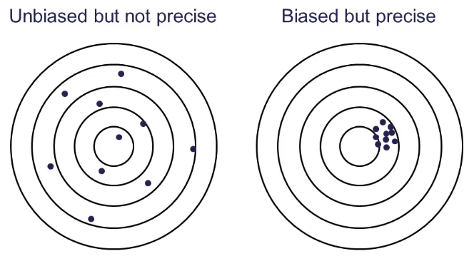

The best that you are making is that anything that is in the group on the right is likely to be closer to the center of the target than a random point taken from the group of the left.

We are going to intentionally not aim at the right answer to get better precision. Typically, we won't have a flipped sign on a parameter estimate.

#### Approaches

Ideally, the criteria for deciding when biased regression techniques are better than OLS depends on the true values of the parameters.

Since this is not possible, there is no completely objective way to decide; there are many different techniques. Two popular ones are:
- Principal Components Regressions (PCR)
- Ridge Regression

You can use **VIF > 10** and/or when you have a flipped sign. We only see flipped signs when beta is close to zero. 

Ideally, drop a variable if you can, instead of using PCR or ridge regression. These are last-ditch effort techniques.

#### Principal Components Regression

Every linear regression model can be restated in terms of a new set of orthogonal predictor variables that are a linear combination of the original variables. These are called **prinicipal components**. The weighted set of variable combinations are orthogonal and not correlated at all.

In principal components, you do not take into consideration the responsible variable at all. PC 1 represents the most variability in the data cloud. Once we establish the first one, the others become easier -- we just find the directions orthogonal. The direction orthogonal to PC 1 is PC 2. If you have 10 variables, you have a 10-dimensional data cloud and you have to have 10 Principal Components to describe it.

PCs are a linear combination of the old variables. Take the coefficients on all of the variables that comprise the Principal components -- put them in a vector and you have an eigenvector. The eigenvalue is just the length of the eigenvector.

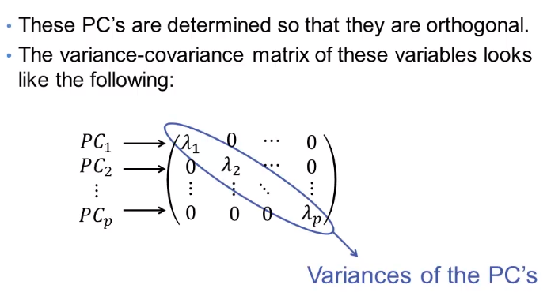

The Principal Components are not related to each other. We can take the PCs and use them in the regression instead.

If we have a variable with variance 0, then that is just a constant. We are going to look for eigenvalues that are really close to 0 - this will help us.

**Example: French Economy**

Data from the French economy reported by *Malinvaud (1968)*. Variables:
- Imports
- Domestic Production
- Stock Formation (money)
- Domestic Consumption

SAS example. Look at a standard regression:

```
proc reg data=Advanced.French;
    model Import = DoProd Stock Consum / vif;
run;
quit;
```

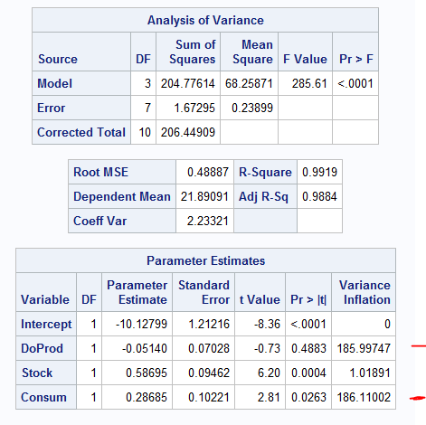


Use PROC PRINCOMP to get the principal components that can be used in another regression.

```
proc princomp data=Advanced.French out=frenchPC;
    var DoProd Stock Consum;
run;
```

Recall that Principal Components don't have anything to do with your Y -- only with x values. 

**When you use principal components, you must standardize your variables first. SAS does this. R does not do this.**

Center at 0 with a standard deviation of 1.

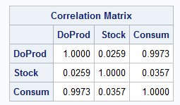

Now, we have the eigenvalues and eigenvectors. 

The eigenvalues correspond to the eigenvectors that you see down below - they do not correspond to a specific variable.

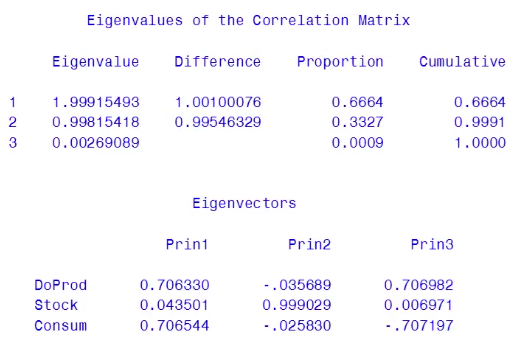

Your first eigenvector (Prin1) has an eigenvalue of ~ 2.

You can still look at the eigenvectors and determine which variables are "driving" each dimension. The third Principal Component has domestic production at 0.7. The third principal component has consumption rate at -0.7 The third eigenvector (PC) barely contains any of the information.

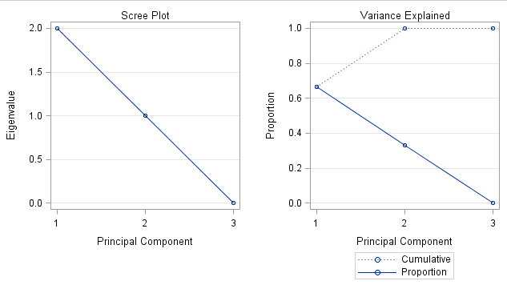

Basically, the 3rd principal component isn't very useful. 

This is how you would calculate the value of the 3rd principal component.

c<sub>3</sub> = 0.71DoProd + 0.007Stock - 0.71Consum

We're trying to figure out relationships. Set c<sub>3</sub> to 0. Stock is basically 0. Therefore, the 3rd eigenvector is basically telling you that DoProd and Consum are the same piece of information.

0 = 0.71DoProd - 0.71Consum
0.71Consum ~= 0.71DoProd

You really only can do this with eigenvalues that are almost equal to zero -- to understand the relationships between the other variables.

One problem with R is that if R thinks that the value is close to 0, R will not give it to you by default.

This makes it look like PrinComp 3 is not very important. 

What we do is we put the principal components back into the regression. There is no multicollinearity at all when performing regression with the PCs. 

The Y is standardized -- hence Y-tilde:

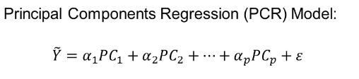

```
proc princomp data=Advanced.French out=frenchPC;
    var DoProd Stock Consum;
run;

* Use the frenchPC to standardize the Y;

proc standard data=frenchPC mean=0 std=1 out=frenchPC2;
    var Import;
run;

* frenchPC2 contains standardized inputs as well as the standardized Y values;

* Here we run the regression with the principal components instead;

proc reg data=frenchPC2;
    Reg: model Import = DoProd Stock Consum /vif;
    PCa: model Import = Prin1 Prin2 Prin3 /vif;
    PCb: model Import = Prin1 Prin2 /vif;
run;
quit;
```

There's no strict rule to how much variability a PC has to have in order to keep it. 

In the `Reg:` look at SSM values and compare to the following ones.

At this point, all we have done is rearranged the variables. Note that the SSM, error, etc... all are the same. The model is the exact same as we have done before. At this point, we have hidden the multicollinearity problem, but have not "solved" it.

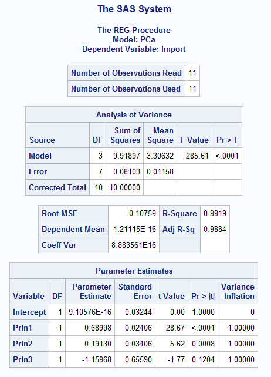

Now, we have dropped PC3 and have a biased model -- that helps solve the multicollinearity problem.


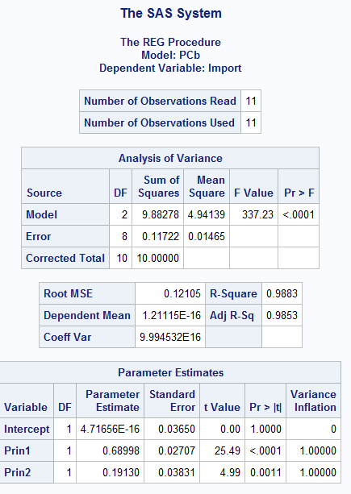

Now we have different SSM and SSE.

**You must drop at least 1 principal component if you want to solve anything with multicollinearity.**

#### Interpretation...

The problem here, now, is that we don't know how to interpret the principal components. 

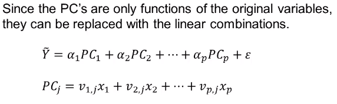

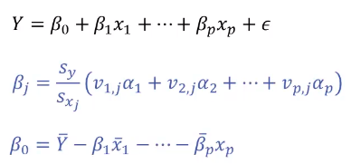

This gets the biased values out, but they should be closer to the actual value, on average, than when you have multicollinearity. 

You can do PCR Replacement. 

PROC PLS (Partial Least Squares) will partially solve this for you. `method=pcr` means Principal Component Regression. If you put `nfac=2` it means that you only want PC1 and PC2. The principal components usually are ordered by their eigenvalues, so that usually what you want. However, if you ever want to use PCs that aren't in order, say 1,2,3,5,6, then you cannot use this approach.

Another time that you might want to drop a PC is if it is not significant because it only relates to a variable that has nothing to do with Y.

```
proc pls data=Advanced.French method=pcr nfac=2;
    model Import = DoProd Stock Consum / solution;
run;
quit;
```

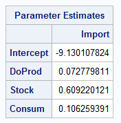

#### Cautions with PCR

- It may not always work. You may have trouble explaining variability in the response variable. If they all provide some good information, you cannot blindly drop them.
- Outliers and influential observations severely distort the principal components because they alter the variance-covariance matrix. 
- Principal components only deal with continuous variables. You cannot work with categorical variables. Correlations are harder to work with using categorical variables. 

### Ridge Regression

The whole point of penalized regression is that we have severe multicollinearity and we cannot get rid of it using the desired methods (such as dropping a variable out of the model). If you need to keep the variables, then you have to use a biased regression technique to get around it.

**Ridge regression is a biased regression technique to use in the presence of multicollinearity**

It produces estimates that tend to have lower Mean Square Error (but higher bias) than OLS estimates. The Mean Square Error for the betas -- that's what we are trying to minimize here -- not the MSE for the model.

Ridge regression works with standardized values for each of the variables in the model (similar to PCR):

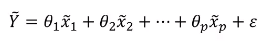

Y-tilde is a standardized Y. The thetas represent the standardized values. 

Solving for OLS estimates involves the **normal equations**. The following is the same as (X<sup>T</sup>X)Beta = X<sup>T</sup>Y:

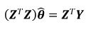

In linear algebra class, we saw (A<sup>T</sup>A)x = A<sup>T</sup>b. It is the exact same thing as this. It is just a system of linear equations. 

Think of (Z<sup>T</sup>Z) as A, theta as x, and Z<sup>T</sup>Y as b, to get to the reduced form that we dicussed as

Ax = b

a<sub>11</sub>x<sub>1</sub> + a<sub>21</sub>x<sub>2</sub> + a<sub>31</sub>x<sub>3</sub> + ... = b<sub>1</sub>
a<sub>12</sub>x<sub>1</sub> + a<sub>22</sub>x<sub>2</sub> + a<sub>32</sub>x<sub>3</sub> + ... = b<sub>2</sub>
...

That is the same as this:


So, r<sub>1,y</sub> is the correlation between x<sub>1</sub> and y. Etc... **In the matrix in the above image, the diagonal has all values of 1.** That is because the thetas represent the correlation between a variable and itself. 

Next, we manipulate the original normal equations into the ridge equations. These are the **ridge adjustments**.

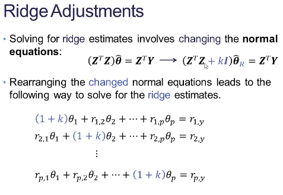

In this image, we don't want *k* to infiltrate every piece of the equation, so we multiply it by the identity matrix. All that *kI* really is is just a matrix with *k* on the diagonal and 0 everywhere else. We are biasing the original normal equation -- biasing them. 

*k* is the bias parameter. Under the normal OLS equations, k = 0. When we move k away from zero (and it must be positive), it biases the equation. What we are doing is making the correlation between x<sub>1</sub> and x<sub>1</sub> greater than 1. The same holds true for the other variables, too. We are biasing with the bias constant. 

The bigger the value of *k*, the more bias we are introducting. Hence, we have to figure out how much bias we need to introduce in order to fix the problem and minimize the variability. 

**The hardest part about ridge regression is choosing the appropriate value of *k* beacuse there exists many different ways proposed over the years.**

#### The Fixed-Point Method

The **HKB Estimate** is called the **fixed-point estimate** of k. Hoerl, Kennart, Baldwan. p is the number of variables in the model. sigma-hat-squared is the Mean Square Error for the *model*, which comes from the ANOVA table in PROC REG. This is not the same as the MSE that we discussed earlier. 

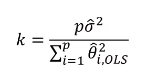

The denominator is the sum of the squares of all of the thetas from the OLS estimates. We estimate the thetas from the original equation using the normal equations, just like we would with a normal regression. We then use the errors from them (knowing there is multicollinearity) and use them to calculate the value of k. We can do this in SAS.

`_RMSE_` is the square root of the MSE. 

`outseb` outputs the standard errors of the betas. The `outvif outseb outest=B` line outputs all of those to the data set called B. 

**Ridge regression is contained inside of PROC REG and is called with the ridge option.**

```
/* Ridge Regression - Fixed Point */

proc standard data=Advanced.French mean=0 std=1 out=frenchstd;
    var Import DoProd Stock Consum;
run;

proc reg data=frenchstd outest=B;
    model Import = DoProd Stock Consum / vif;
run;
quit;

data _null_;
    set B;
    call symput('MSE', _RMSE_**2);
    call symput('k', 3*_RMSE_**2 / (DoProd**2 + Stock**2 + Consum**2));
run;

proc reg data=frenchstd outvif outseb outest=B ridge=&k;
    model Import = DoProd Stock Consum / vif;
run;
quit;
```

Although SAS does the ridge regression, it does not provide it in the output. You have to output it into a data set and then print the data set. 

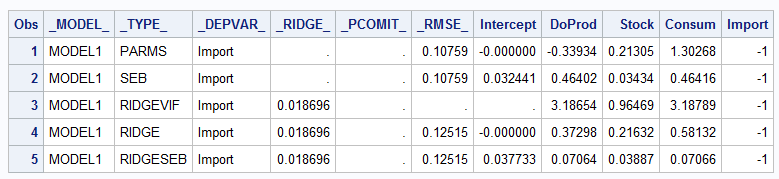

The first row is from the original model. The second row are the standard errors from the normal regression. 

The next three rows have the information we want. The `RIDGEVIF` show the VIF values from the ridge regression. That is a significant decrease from the original VIF values. 

Ridge regression adds bias in a different way, so the VIF values are not forced to be 1. The bias is spread to everything, though, so you see that the Stock variable went from a VIF near 1 and dropped -- the variance deflated.

The `RIDGE` line shows the parameter estimates with the ridge regression. The `RIDGESEB` shows the standard errors from the ridge regression. 

This is how you perform ridge regression. The only thing that changes with other approaches is how you calculate k. 

#### The Iterative Method

This is an iterative method that has the exact same first step as the fixed-point method. The theta values on the denominator come from the values that we derived with the fixed point. The original betas were used to get an estimate of k, but then they get another estimate of k using the new betas derived from the first pass. They continue iterating until the change is negligible. In practice, you only need to go 2 or 3 steps until the change is negligible.

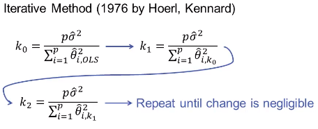

Doing this in SAS. You run the loop until you are happy with the negligible change.

```
/* Ridge Regression - Iterative Method */

proc standard data=Advanced.French mean=0 std=1 out=frenchstd;
    var Import DoProd Stock Consum;
run;

proc reg data=frenchstd outest=B;
    model Import = DoProd Stock Consum / vif;
run;
quit;

proc print data=B;
run;

data _null_;
    set B;
    call symput('MSE', _RMSE_**2);
    call symput('k', 3*_RMSE_**2 / (DoProd**2 + Stock**2 + Consum**2));
run;

proc reg data=frenchstd outvif outseb outest=B ridge=&k;
    model Import = DoProd Stock Consum / vif;
run;
quit;

proc print data=B;
run;

* We use _TYPE_ = 'RIDGE' to get the new coefficients, but 
recall that MSE was calculate previously;

data _null_;
    set B;
    where _TYPE_ = 'RIDGE';
    call symput('k', 3*&MSE / (DoProd**2 + Stock**2 + Consum**2));
run;

proc reg data=frenchstd noprint outvif outseb outest=B ridge=&k;
    model Import = DoProd Stock Consum / vif;
run;
quit;

proc print data=B;
run;
```

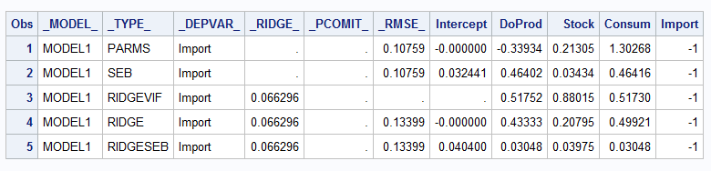

This table is after two iterations. We may have gone too far because the VIF values have all gone below 1. That is an indication that we probably don't want to do this again. You probably want to go with the original estimates. If you run it again, you'll see that the parameter estimates aren't really changing much -- this counts as negligible change. Again -- the VIFs are low, so we probably don't want to continue. 

Finding the optimal value of k is not easy.

#### The Ridge Trace

This is a plot of many different values of theta-hat across many different values of k. We plot it all and look at what is happening to the VIFs and the theta-hats. Note that we just give SAS a range to plot.

```
/* Ridge Regression - Ridge Trace */

proc reg data=frenchstd outvif outest=B ridge=0 to 0.08 by 0.002;
    model Import = DoProd Stock Consum / vif;
run;
quit;

proc reg data=Advanced.French outvif outseb outest=B ridge=0.04;
    model Import = DoProd Stock Consum / vif;
run;
quit;

proc print data=B;
run;
```

The two charts here show the range. The top chart is the VIF. The bottom chart are the standardized coefficients. This is typically why we work with standardized coefficients -- so that they are on an approximately equal scale, which makes the charts a lot easier to read. 


As we add more and more bias, the two variables are converging in parameter estimate. If you think about it, they are providing the same information. The more and more bias that you add, the ridge regression basically forces them to be the same. 

The hard part about the ridge trace: rule of thumb: you go on the chart to where the lines first begin to become approximately horizontal -- that provides the k value that you may want to use. 

You then can zoom in to see more detail:

```
proc reg data=frenchstd outvif outest=B ridge=0.02 to 0.05 by 0.002;
    model Import = DoProd Stock Consum / vif;
run;
quit;
```

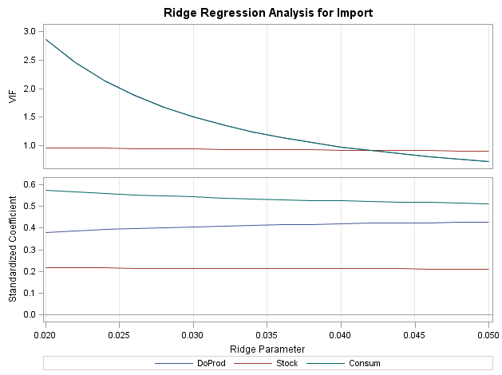

The curves become negligible around 0.04. 

**We then can calculate the estimates using that k value. Notice that we used the standardized values to pick out the ridge value. Then, we can run this ridge regression with the original data set and get the actual beta values out into the B data set.**

```
proc reg data=Advanced.French outvif outseb outest=B ridge=0.04;
    model Import = DoProd Stock Consum / vif;
run;
quit;

proc print data=B;
run;
```

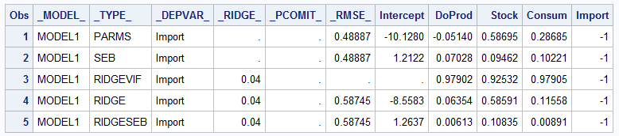

#### Cautions with Ridge Regression

- Due to the uncertainty of how to calculate *k*, there are some that dislike the use of ridge regression (or any other bias regression technique).
- Both PCR and ridge regression should be used as a **last case scenario**.
- Deleting/combining variables is preferred because it doesn't introduce bias.
- These methods, however, should **not** be shunned.

#### Relevant R Code

```
## Read in the Data Set 
French <- read.csv('C:/data/French.csv')

attach(French)
names(French)

## Calculate VIF's
library(car)
model <- lm(Import ~ DoProd + Stock + Consum)
vif(model)

## Calculate Principal Components
X <- French[,-1]
X <- X[,-1]
Scale.X <- scale(X) ## Variables need to be standardized before PCA, princomp function does not automatically do this

PC <- princomp(Scale.X)
loadings(PC)

## Principal Components Regression
Scale.French <- scale(French)

model.1 <- lm(Scale.French[,2] ~ Scale.French[,3] + Scale.French[,4] + Scale.French[,5])
vif(model.1)

model.2 <- lm(Scale.French[,2] ~ PC$score[,1] + PC$score[,2] + PC$score[,3])
summary(model.2)
vif(model.2)

model.3 <- lm(Scale.French[,2] ~ PC$score[,1] + PC$score[,2])
summary(model.3)
vif(model.3)

## Get Model in terms of original variables
beta.DoProd <- (sd(Import)/sd(DoProd))*(loadings(PC)[1,1]*model.3$coefficients[2] + loadings(PC)[2,1]*model.3$coefficients[3])
beta.Stock <- (sd(Import)/sd(Stock))*(loadings(PC)[1,2]*model.3$coefficients[2] + loadings(PC)[2,2]*model.3$coefficients[3])
beta.Consum <- (sd(Import)/sd(Consum))*(-1)*(loadings(PC)[1,3]*model.3$coefficients[2] + loadings(PC)[2,3]*model.3$coefficients[3])

Intercept <- mean(Import) - beta.DoProd*mean(DoProd) - beta.Stock*mean(Stock) - beta.Consum*mean(Consum)

## Ridge Regression
library(MASS)

plot(lm.ridge(Import ~ DoProd + Stock + Consum, lambda = seq(0,0.1,0.001)))
lm.ridge(Import ~ DoProd + Stock + Consum, lambda = 0.04)

```

----

### Instrumental Variables

We work with instrumental variables when we are trying to solve problems of independence. When the errors are not independent, we can use instrumental variables.

Assumptions of linear regression are that the errors are independent. 

**An extension of this assumption is that explanatory variables are independent of the errors -- called exogenous variables.**

E(e|X) = 0

The expected value of your errors given the fact that you know what your X values are, are equal to zero. If somebody tells you the value of X, it should not influence what you think will happen with the errors.

We're saying that the errors are independent of the X's. When this is the case, they are **exogenous variables**. 

Variables that are correlated with the errors are called **endogenous variables**. They are bad!

*If an explanatory variable is endogenous, then the OLS parameter estimates become biased:

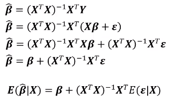

The top equation is the solution to linear regression. We know what Y is, so we plug in what it equals, to get the second line. The regression line is XB + e. Y is a function of the true value of beta. The third line is simply matrix multiplication using the distributive property. Line 4 is just simplification. 

(X<sup>T</sup>X)<sup>-1</sup>X<sup>T</sup>X is just equal to 1. Just multiplying something by itself. 

On average, what is the last piece of the last formula going to be? If you expect the errors to be 0, then you're saying that on average, the expected value of beta-hat, given X is equal to beta.

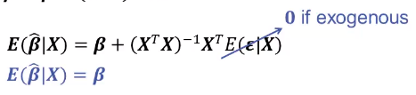

If the last little piece doesn't equal zero, then that means that our beta-hat values, on average, are not equal to beta. They are beta plus junk and we don't know what that junk is. That, in essence, is what is going on when you don't have exogenous variables. When you estimate your regression equations, you won't be estimating the actual true beta, you'll be estimating something different.

With PCR and ridge regression, we were trying to estimate something with a bias. That's ok when you know that and you are trying to do it. You do not want that when you don't know about it. 

**When does this actually happen?**

Endogeneity:
- There are two common situations that have the problem of endogenous explanatory variables:
  - Omitted Variables
  - Measurement Error

When people round their salary, for instance, that is measurement error. "I make $25k" instead of 25,434. 

#### Omitted Variable Bias

Omitted Variable Bias occurs when a potentially useful variable in the model is omitted from the model for any reason. 

Sometimes we don't even know that we are leaving it out. This is one of the scariest ones. Sometimes, we can't really collect one of the variables. For example, you can't measure the "it" factor. There are issues when you cannot use some data. For instance, banks are not allowed to use your sex to determine when they will give a loan. Legally, they cannot use the information. 

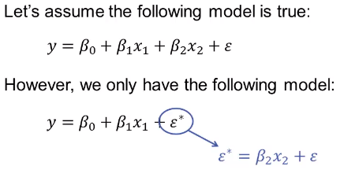

Everything that is not in the model is thrown into the error term. In this situation, x<sub>2</sub> is in the error term. **This is only a problem if x<sub>1</sub> and x<sub>2</sub> are correlated with each other!**

#### Measurement Error

When considering measurement error, there are two situations:
1. Response Variable
2. Explanatory Variable

**Response**

Instead of measuring y, what if we measured y-tilde which is equal to y + v, where v is a white noise error term (mean of zero and constant variance).

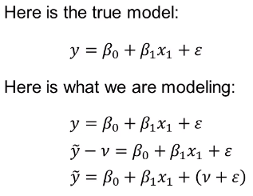

If you measure y incorrectly, then the whole model has more error than it really should have. In this example, as long as x<sub>1</sub> is not related to e or v this won't be a problem. It's usually not a  huge problem when you measure y incorrectly - just more error.

**Explanatory**

Instead of measuring x<sub>1</sub> what if we measured x-bar<sub>1</sub> = x<sub>1</sub> + v<sub>1</sub>, where v is a white noise error term (mean of zero and constant variance).

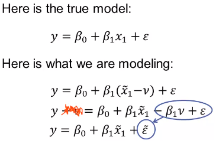

This makes x<sub>1</sub> correlated with the error term. If you measure x high, the error will be high. If you measure it low then the error will be low.

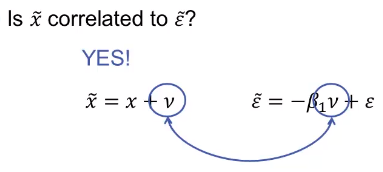

If we measure our predictor variable incorrectly, then our parameter estimate beta-hat<sub>1</sub> is biased! The bias is directly dependent on the size of the measurement error in relation to the scale of the data. 

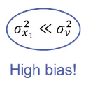

If the variance of the error in the measurement is greater than the variance of the actual value you are measuring, then you have serious bias problems.

#### Solutions

Omitted variables and measurement error are two common situations to show where endogeneity pose problems in data analysis. A solution to these problems of endogeneity is the use of **instrumental variables** and **two-stage least squares**. 2SLS

**Examples**

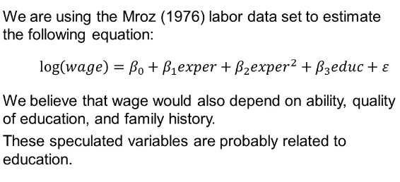

The issue is that we believe that wage depends on things that we cannot measure, such as quality of education. 

### Instrumental Variables and 2SLS

An instrumental variabe is a variable that is related to the predictor variable (the endogenous ones), but not related to the error term (it is itself exogenous).

You must have at least one instrumental variable for every endogenous variable in your model. These are not as easy to find as you might think. You frequently have to go out and collect extra information to find instrumental variables. 

Here's how it works:

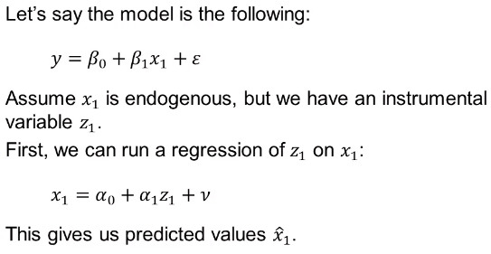

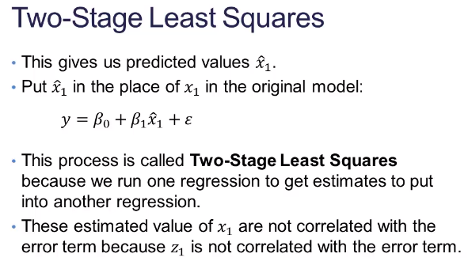

You want to get an unbiased estimate of how x<sub>1</sub> affects Y, but in order to get that effect, you have to first build a regression with the instrumental variable to predict x<sub>1</sub>. If you just replace that with the instrumental variable, then you aren't predicting Y with x<sub>1</sub> at all. 

You can use more than 1 instrumental variable to predict x<sub>1</sub>. You don't want to over specify with too many. 

The equation for 2SLS is:

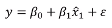

This means that the 2SLS estimate of beta<sub>1</sub> is unbiased compared to the OLS estimate. You can always add more instrumental variables to the prediction of x<sub>1</sub>.

#### 2SLS in SAS

```
* Deleting people who weren't paid and creating other variables;
data Advanced.Mroz;
    set Advanced.Mroz;
    if infl=0 then delete;
    lwage = log(wage);
    expersq = exper*exper;
run;


* Just a regular regression to see what you get;

proc reg data=Advanced.Mroz;
    model lwage = exper expersq educ;
run;

* Using mother's education as an instrumental variable on education itelf. This is not required - it is just a way to test to see if these are related;

proc reg data=Advanced.Mroz;
    model educ = motheduc;
run;

* The following is how we actually do the 2SLS;

proc syslin 2SLS data=Advanced.Mroz;
    endogenous educ;
    instruments exper expersq motheduc;
    model lwage = exper expersq educ;
run;

```

With PROC SYSLIN, you have to give `2SLS` as an option. The endogenous statement is where you put in the variables that you think are endogenous. The model statement is the same as the regression model from the top. The instruments statement is confusing. The instrumental variable is mothers education. In the instruments statement, you have to specify every variable that you are going to have in the model that are exogenous. (Would make more sense if it were an exogenous statement...). 

SAS calculates this in the back with linear algebra, in one single step. Since it isn't doing 2 regressions, you don't need to match up the instruments with the endogenous variables. You just throw in all of the ones that you want to work with. 

It is hard to see endogeneity problems in the output itself.

When you run the first regression, the t-test to see whether education is significant shows that it is. However, if you have bias, then you cannot trust the t-tests. If you run the 2SLS, you see that education no longer is significant. Also note the change in the parameter estimates.

Next, we try to see if other variables predict education. When we include all of the exogenous variables, then we get a better prediction of education and the final probability seems significant.

```
proc reg data=Advanced.Mroz;
    model educ = motheduc fatheduc huseduc;
run;

proc syslin 2SLS data=Advanced.Mroz;
    endogenous educ;
    instruments exper expersq motheduc fatheduc huseduc;
    model lwage = exper expersq educ;
run;
``` 

How do we determine if we have an endogenous predictor variable? How do we know whether we used too many instrumental variables?

#### Test of Endogeneity

We can test to see if we have a problem with endogeneity and also test to see if we "oversolved" the problem by using too many instrumental variables. 

There are several steps in the process.

H<sub>0</sub>: x<sub>i</sub> is *exogenous*
H<sub>a</sub>: x<sub>i</sub> is endogenous

We want a high p-value when doing this test. That means that the variables are exogenous and we don't have a problem of independence.

Steps:
1. **Regress x<sub>i</sub> on all other predictor variables and instrumental variables.** 
2. Keep the residuals. They are all of the extra information that variable provides that none of the variables do. 
3. Regress y<sub>i</sub> on all variables (except instrumental ones) and the residuals from the previous step.
4. Test coefficient on residual variable. 

If the coefficient is **not significant**, then x<sub>i</sub> is exogenous.
If the coefficient is **significant**, then x<sub>i</sub> is endogenous.

In the following, we think that education is a suspect variable, so you run a regression with education as the outcome and the other "good" variables and instruments as the predictors. 

Then take those residuals and put them into a model with wage (the end goal) with all of the other variables, but **without** instruments. 

```
/* Endogeneity Test */

proc reg data=Advanced.Mroz;
    model educ = exper expersq motheduc fatheduc huseduc;
    output out=mroz_endo r=res_educ;
run;

proc reg data=mroz_endo;
    model lwage = exper expersq educ res_educ;
run;
```

Then, we ONLY focus on the residuals and whether they are significant in the second regression.

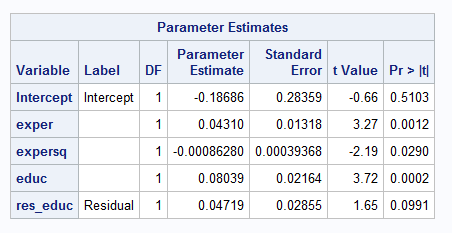

The residuals do not appear to be significant, which means that education likely is exogenous. 

So, let's go through and run this and see if there are other issues that we need to address. 

#### Test of Overspecification

If x is a perfect prediction with all of the instruments, then we basically have repeated the endogeneity problem that we had before. We therefore know that we cannot use all of the information that x contains. We do not want to do a perfect prediction.

For the test of overspecification:
H<sub>0</sub>: Not too many instrumental variables
H<sub>a</sub>: Too many instrumental variables

**Steps:**
1. Estimate by 2SLS and keep residuals.
2. Regress residuals on all exogenous variables (including instrumental variables).
3. Obtain R<sup>2</sup>.
4. nR<sup>2</sup> ~ X<sup>2</sup><sub>p</sub> where p = # of instrumental variables - # endogeneous variables

There's a different order of things in `PROC SYSLIN`. The out statement is at the top. 

```
/* Overspecifiaction Test */

proc syslin 2SLS data=Advanced.Mroz out=mroz_over;
    endogenous educ;
    instruments exper expersq motheduc fatheduc huseduc;
    model lwage = exper expersq educ;
    output residual=res_lwage;
run;

proc reg data=mroz_over;
    model res_lwage = exper expersq motheduc fatheduc huseduc;
run;
quit;
```

From the second regression, n = 428 and R<sup>2</sup> = 0.0026. Take those values and calculate the necessay values in a data step. We use 2 degrees of freedom because we have 3 instruments and 1 problem variable.

```

data mroz_test;
    chi = 428*0.0026;
    pvalue = 1 - CDF('chisquared',chi,2);
run;

proc print data=mroz_test;
    var chi pvalue;
run;
```
We did not overspecify, based on these results:

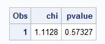

#### Simultaneous Equations

Simultaneous equations are best summed up with an example. Supply and demand are simultaneous equations, where effects of one model will change the effects of another model, which in turn goes back and changes the effect of the first model. 

Consider the relationship between crime rates and the number of police officers. Crime rate probably depends on how many police officers there are to reduce it -- hopefully a negative relationship. However, the number of police officers probably depends on the crime rate -- most likely a positive relationship.

These equations are referred to as **structural equations** in economics. 

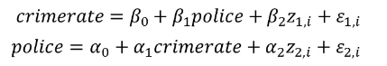

This is a problem of endogeneity, though it isn't apparent at first. If we solve for crimerate:

The final combined equation is called a **reduced form equation**, as show at the bottom here.

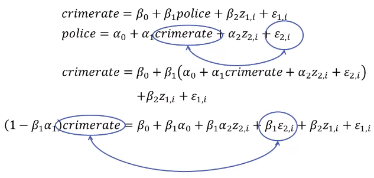

When you solve this out for crimerate, you find out that you have an x that is correlated with the error that is included in the model. When you have equations that influence each other, there is a lack of independence in the model. 

Solving them:
- Simultaneous equations lead to the problem of endogeneity.
- Very similar to the problem of an explanatory variable being measured with error.
- Therefore, using OLS on this problem will lead to biased estimates. 
- We can use 2SLS to solve this problem! We already have the instrumental variables.
- Typically, the trouble with 2SLS is finding good instrumental varialbes -- not as much the case in simultaneous equations.

We will use z<sub>2</sub> as the instrument. You can do 2SLS on either of the equations.


Which you use when doing 2SLS depends on your goal and what you are trying to explain.

Imagine that we have these simultaneous equations:

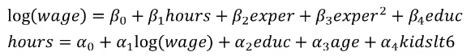

We have a set of simultaneous equations with hours and wage. Recall that the data set is entirely females.

```
/* Hypothesized Equations */

proc reg data=Advanced.Mroz;
    model lwage = hours exper expersq educ;
run;

proc reg data=Advanced.Mroz;
    model hours = lwage educ age kidslt6;
run;
```
Predicting wage:

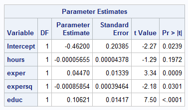

Predicting hours:

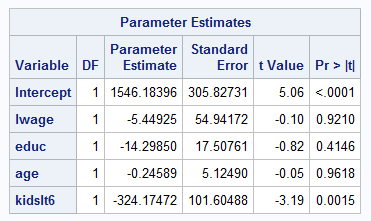

If we have a problem of independence, we cannot trust the t-tests on hours and wage. 

It does not matter which of the 2SLS you run -- depends on what you are trying to predict. Here we first will try to predict wage and we think that hours is endogeneous. We list all exogeneous variables as instruments. 

What instruments can we use to try to take the place of hours? When we looked at the previous regression, we saw that we could potentially use `kidslt6` and `age`. 

```
/* Two-Stage Least Squares */

proc syslin 2SLS data=Advanced.Mroz;
    endogenous hours;
    instruments exper expersq educ age kidslt6;
    model lwage = hours exper expersq educ;
run;

/* Same thing with the other equation */

proc syslin 2SLS data=Advanced.Mroz;
    endogenous lwage;
    instruments exper expersq educ age kidslt6;
    model hours = lwage educ age kidslt6;
run;
```

The old t-test was not a valid one because of the endogeneous relationship. However, we can trust this t-test and it does not look like the number of hours that you work affects your wage. Notice that there is a small drop in the R<sup>2</sup> value from the original regression to the 2SLS. 

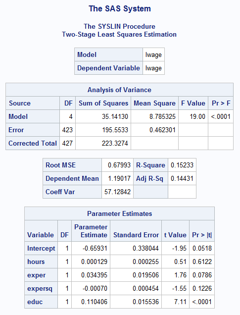

#### Estimating Parameters in Simultaneous Equations

How could we measure the impact of an increase in an exogenous variable on the endogenous variables?

For example, what would be the impact of increasing the variable per capita income on crime rate?
- The variable per capita income impacts number of police officers.
- Number of police officers impacts crime rate.
- Crime rate affects number of police officers.
- Number of police officers impacts crime rate.

We need the reduced form equations to help! This is the true relationship for crimerate.

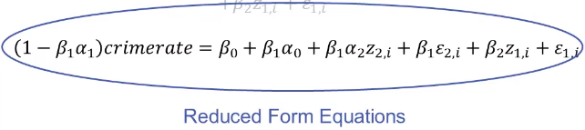

You want to know the value -- if z<sub>1</sub> goes up by 1, what happens to the crime rate? 

There are two approaches to estimating the parameters:
1. We could plug in the 2SLS estimates into the reduced form equation to get an estimate.
2. Just run a regression of crime rate on all of the exogenous variables to get an estimate. Get the standard errors for the t-tests!

You want to truly understand the effect of education on wage. Plug the reduced form equation into SAS and you actually will get the answer. 

```
/* ORIGINAL Hypothesized Equations */

proc reg data=Advanced.Mroz;
    model lwage = hours exper expersq educ;
run;

proc reg data=Advanced.Mroz;
    model hours = lwage educ age kidslt6;
run;


/* BETTER More Accurate Parameter Estimates */

proc reg data=Advanced.Mroz;
    model lwage = age kidslt6 exper expersq educ;
run;
quit;
```

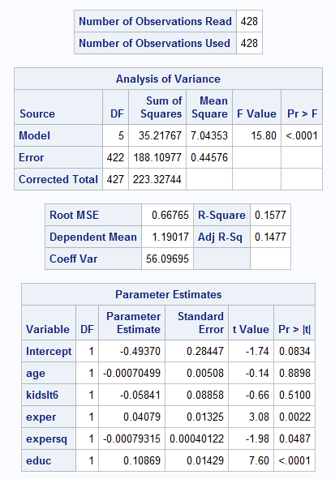

Here, we can look at education and just understand the effect. 


Situations where there are problems with independence, all of which can lead to problems with endogeneity:
- Omitted Variable Bias
- Measuring things with error
- Simultaneous Equations

### Heteroscedasticity and Weighted Least Squares (WLS)

Weighted least squares is used in a lot of different fields, including time series and outlier analysis. 

**Homoscedasticity** is when the variance is constant across all errors. Hetereoscedasticity is when the variance is not constant. You want the errors to equally accurate across all values that you are predicting. 

We often see this as a fan shape in the distribution of the error terms.

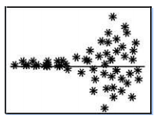

Your parameter estimates are not bothered at all by heteroscedasticity. **The problem is that the standard errors of the parameter estimates are compromised.** Any inferences under the traditional assumptions will be incorrect. Hypothesis tests and confidence intervals based on the t, F, X<sup>2</sup> distributions will not be valid.

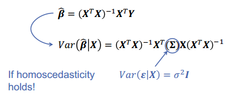

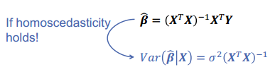

In the case of homoscedasticity, the variance is just a constant multiplied by the identity matrix. 

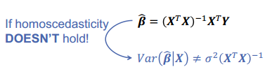

The software packages will not report the proper variances if there is heteroscedasticity because it is assuming that there is homoscedasticity.

#### Accounting for Heteroscedasticity

There are several approaches to this.

1. Calculate statistics that are robust to heteroscedasticity.
2. Account for heteroscedasticity in the estimation process through Weighted Least Squares (WLS).

How do we detect it? Just looking at a residual plot is the easiest way:

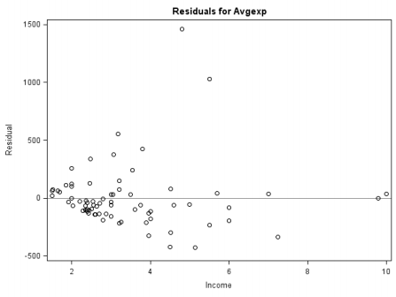

There are formal tests for heteroscedasticity.
1. White's general test
2. Breusch-Pagan test

For both tests:
H<sub>0</sub>: Homoscedasticity
H<sub>a</sub>: Heteroscedasticity

High p-values are what we want.

#### White's general test

The test created by White is a general test that looks for the relationship between the variance of the residuals and functions of the predictor variables. 

Steps:
1. Use OLS to estimate the residuals and their variance.
2. Conduct OLS on the variance with all predictor variables, their squared values, and their interactions. Trying to predict the variance of the residuals based on the inputs in the model.
3. Record the R<sup>2</sup> value - nR<sup>2</sup> ~ X<sup>2</sup><sub>p-1</sub>

**Disadvantages**
1. There is low power in actually detecting heteroscedasticity when it might exist. It leans on the side of telling you that you do not have a problem.
2. If you reject the null hypothesis in the White test, there is no indication of the problematic variables.

#### Breusch-Pagan Test

Heteroscedasticity is typically caused by a relationship of the variance of the residuals with one (or more) predictor variables (or functions of them). The Breusch-Pahan test is preferred to the White general test because it restricts attention on specific explanatory variables.

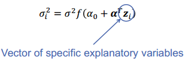

H<sub>0</sub>: a = 0
H<sub>a</sub>: a != 0

We are just testing if the coefficients on the vector of problem variables are equal to 0. 

#### Example with Credit Card Expenses Data

Monthly credit card expenses for 100 individuals. We are going to try to predict the spending on their cards. Use some of these variables:
- Age
- Income 
- Ownership of a home
- Self-employment Status

Set up the data

```
data Advanced.CCE;
    set Advanced.CCE;
    if Avgexp=0 then delete;
    income_sq = income*income;
run;

proc reg data=Advanced.CCE plots(unpack);
    model Avgexp = Age Ownrent Income Income_sq;
run;
quit;

```

Using `PROC MODEL` to run the Breusch-Pagan test.

With `parms`, you are defining what you are going to call your parameter estimates. The first thing defined here, `Const`, is the intercept. Then, betas for each variable are defined.

You then have to define the model, which is presented on the next line. `Avgexp` is average expenditure. 

The `fit` statements are telling proc model to fit the equation that we entered. It assumes that it will minimize the errors. We then define the tests with `white` and `breusch`. The options on breusch is where you define which variables you want SAS to consider. On the first `fit` line, we are asking SAS to test income and income_sq. The `1` is just an intercept -- telling SAS to fit a regression and that the regression will have an intercept, income, and income_sq. 

```
proc model data=Advanced.CCE;
    parms Const B_Age B_Ownrent B_Income B_IncomeSq;
    Avgexp = Const + B_Age*Age + B_Ownrent*Ownrent + B_Income*Income + B_IncomeSq*Income_sq;
    fit Avgexp / white breusch=(1 income income_sq);
    fit Avgexp / white breusch=(1 age);
    fit Avgexp / white breusch=(1 income income_sq age);
run;
quit;
```

The first test will tell you: is the problem isolated in my income information? The second: is the problem isolated in my age information?

There can be heteroscedasticity in different directions. For instance, income might be fanning down and age might be fanning up. If you put them together, they might cancel each other out, so it's good to test them separately and together.

When we visually examine, we see there's an issue:

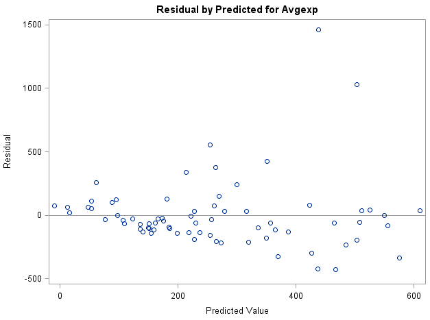

The overall residual plot shows that there might be heteroscedasticity. Unfortunately, this means that the t-tests at the top aren't valid and we have to address the problem and rerun the tests.

Separated out, age looks ok, but income does not.

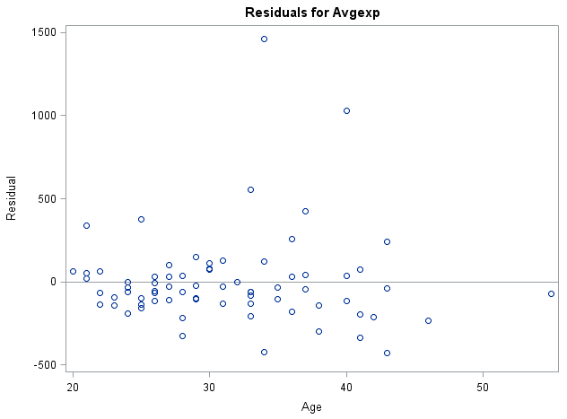


These are the results from the first `fit` line in the above code. White's test shows no problem with heteroscedasticity. The BP test with income says that there is a greater chance of there being a problem when we isolate to income.


These are the results from the second `fit` line, looking at age.


The final one shows that mixing a good variable (age) with a bad variable (income), the BP test will mask the problem. White's test also masks the problem.


#### Addressing Heteroscedasticity Problems - Robust Standard Errors

White proposed a solution for estimating the sigma in a fashion that is robust to heteroscedasticity. The details are in the Applied Econometrics using the SAS system book. 


SAS provides multiple ways to calculate this. 

```
/* Heterscedasticity Robust Standard Errors */

proc model data=Advanced.CCE;
    parms Const B_Age B_Ownrent B_Income B_IncomeSq;
    Avgexp = Const + B_Age*Age + B_Ownrent*Ownrent + B_Income*Income + B_IncomeSq*Income*Income;
    fit Avgexp / HCCME=NO outest=ols covout;
    fit Avgexp / HCCME=0 outest=H0 covout;
    fit Avgexp / HCCME=1 outest=H1 covout;
    fit Avgexp / HCCME=2 outest=H2 covout;
    fit Avgexp / HCCME=3 outest=H3 covout;
run;
quit;
```

`fit Avgexp / HCCME=NO outest=ols covout;` HCCME: Heteroscedasticity Corrected Covariance Matrix Estimates. By default, it is set to NO. The next options output the parameter estimates and the variance/covariance matrix. 

The rest of the lines are the same -- they start at 0. 
- `HCCME=0` is the original White test. 
- `HCCME=1` through `HCCME=3` are the adjustments they made. 3 is the most modern way of using it and what you should try to use. 

`HCCME=3` is a very complicated way of estimating the matrix, so it is not guaranteed to estimate the values, so you may have to use the earlier tests in order to actually calculate the values. If this fails, try `HCCME=1`. It is very easy to calculate. `HCCME=0=2` also is complicated. 

Try them in this order:
- `HCCME=3`
- `HCCME=1`

Once you use the robust standard errors, you can *believe* the t-tests about whether parameters are significant. Notice that the parameter estimates don't change -- only the standard errors do. 

Changing the standard errors does not change the model at all -- it just recalculates the standard errors so that we can trust the tests. The residual plots will still look bad, but the numbers of the standard errors are adjusted to look more believable. This is sort of a "Band-Aid" approach to the problem. 

#### Weighted Least Squares

This *solves* the problem of heteroscedasticity. WLS is used to solve many issues:
- Limit the influence of outliers in regression analysis
- Giving greater weight to more recent observations in time series analysis
- Stabilize variance to satisfy heteroscedasticity.

Instead of minimizing the squared residuals, in WLS the weighted squared residuals are minimized. 


We end up with a weighted sum of squares and weighted residuals. When we minimize errors, we'll say that some observations are worse than others. If we know that our variance depends on some variable x, then that variable x will help us determine how to weight things. If we know that people with higher incomes have higher variability, then people with high incomes will be downweighted compared to people with lower incomes. We do the weighting with x.


Weighted least squares is used predominantly in outlier adjustments and analysis. 

If we know that our variance depends on some function of x (as x increases, the variance increases, for example), what we can do to remove it is to weight each observation by its own value of x. Imagine the weight as w<sub>i</sub> = 1/x<sub>i</sub>. What we are left with at the end is some constant. 

PROC REG can do this for you. However, we have to create the weights first. We know that in this data that the problem is with `income` and `income_sq` -- the Breusch-Pagan test told us that we had a problem. 

This weighting assumes that the variance increases as the x value increases. You can adjust the weighting to handle different situations. 

Now, instead of minimizing the sum of square errors, we are minimizing the sum of weighted square errors.

```
/* Weighted Least Squares - Adjusted Variance Part 1 */

data Advanced.CCE;
    set Advanced.CCE;
    if Avgexp=0 then delete;
    income_sq = income*income;
    wt1 = 1/income;
    wt2 = 1/(income_sq);
run;

proc reg data=Advanced.CCE;
    model Avgexp = Age Ownrent Income Income_sq;
    weight wt1;
run;

proc reg data=Advanced.CCE;
    model Avgexp = Age Ownrent Income Income_sq;
    weight wt2;
run;
```


These parameter estimates are different from the ones we previously calculated. However, they still have the same meaning. They still are unbiased, even though they are different from the OLS estimates. The OLS estimates are the best unbiased estimates, assuming that there are no problems with variance of errors.

**IF** you got the weighting correct, then these standard errors and t-tests are completely valid. How do you figure out if you got the weights correct?

SAS does not show proper residual plots when using weighting with proc reg. It shows the OLS residual plots. If you want to get a notion of whether you fixed the problem, you have to output the residuals and plot them with SGPLOT. 

It may be a combination of problem variables that leads to residual variance. It is common that the variance of y is related to a combination of several predictors. 

In practice, we do not typically know the exact relationship, and tehrefore assume that the variance is a function of our predictor variables:


Need to estimate the function h(x<sub>i</sub>) - this process is called **Feasible Generalized Least Squares (FGLS)**.

#### Feasible Generalized Least Squares (FGLS)

We can let the computer guess what the weighting scheme should be. A typical estimation of h(x<sub>i</sub>) is the power function. This probably is the most commonly used weighting function:


We run a regression of the logs. Estimate variance with squared residuals. The log of the variance as a function of the logs of my problem variables. For each observation, we will calculate the weight using this function.

Get the residuals out of proc reg. Then calculate the logs that we need for the regression. The second proc reg is a regression that calculates the weights. 

```
/* Weighted Least Squares - Adjusted Variance Part 2 */

proc reg noprint data=Advanced.CCE;
    model Avgexp = Age Ownrent Income Income_sq;
    output out=Resid r=residual;
run;

/* Generate the log values for the weighting */

data test;
    set Resid;
    log_e = log(residual*residual);
    log_income = log(income);
    log_income_sq = log(income_sq);
run;

/* Generate the weights */

proc reg noprint data=test;
    model log_e = log_income log_income_sq;
    output out=Resid2 p=Pred;
run;
```

Since everything was changed into log, we have to use the second data step to get rid of the log. Finally, we run the regression using the weights we calculated. 

```
/* Convert weights back from log */
data test;
    set Resid2;
    wt3 = 1/exp(Pred);
run;

/* Regress with the weights */

proc reg data=test;
    model Avgexp = Age Ownrent Income Income_sq;
    weight wt3;
run;
quit;
```

The parameter estimates will be unbiased and these results should be believable. This transformation is similar to the Box-Cox transformation. 

Another common estimation technique for weights. You can try this if the other approach does not work.


```
/* Weighted Least Squares - Adjusted Variance Part 3 */

proc reg noprint data=Advanced.CCE;
    model Avgexp = Age Ownrent Income Income_sq;
    output out=Resid r=residual;
run;

data test2;
    set Resid;
    log_e = log(residual*residual);
run;

proc reg noprint data=test2;
    model log_e = income income_sq;
    output out=Resid3 p=Pred;
run;

data test2;
    set Resid3;
    wt4 = 1/exp(Pred);
run;

proc reg data=test2;
    model Avgexp = Age Ownrent Income Income_sq;
    weight wt4;
run;
quit;
```

### Robust Regression

There are 2 main goals for robust regression:
1. Perform almost as well as OLS in uncontaminated (Normally distributed) data.
2. Perform better than OLS in contaminated (non-Normally distributed data).

An **anomalous observation** is an outlier or an influential point. 

There are two types of anomalous observations that will be discussed:
1. **Outliers**: point with a large standardized residual (lie far away from the fitted line in the Y-direction).
2. **Leverage Points**: point that fall outside the normal range (far from the mean) in the X-space (possible values of the predictors).

Observations could be one or both of these. You can use DFBETA, Cook's D, DFFITS to look for these points. 

This point is not an outlier because you predict it well. However, the point is very influential.


The further away from the horizontal that the point is, the more of a leverage point it will be (and also probably outlier). How you correct for leverage points and outliers is different.

#### Distributional Outliers

There is another way to think about outliers in a regression data set. The outliers are actually a result of the error distribution in the regression not following a Normal distribution -- instead a "thick-tailed" distribution. A distribution with "thicker tails" than a Normal distribution woudl have a higher probability of producing larger errors than those that would be expected from a Normal distribution. This causes an increase in the variability of sigma<sub>e</sub>. 

Robust regression tries to get at the notion that this doesn't follow a Normal distribution.

SAS has 4 different estimation methods for robust regression:
- M-estimation: solves outliers
- LTS (Least Trimmed Squares) estimation: solves leverage points
- S-estimation (don't use this)
- MM-estimation: solves outliers and leverage points.

**Example**

Global Growth Study Data
Variables:
- Labor Force Growth
- Relative GDP Gap
- Equipment Investment
- Non-equipment Investment

Trying to predict growth rate of GDP per worker.

Take a look at it in PROC REG:
```
proc reg data=Advanced.Growth plots=diagnostics(unpack);
   model GDP = LFG GAP EQP NEQ;
run;
```

Ignore the heteroscedasticity for now. Normality is ok, except for the point off to the left.


You can see the influential point here:


With the Studentized Residuals, anything outside of 2 standard deviations is considered a problem. 


Cook's D helps to locate influential points in the data. there are about 3 points really influencing the regression line.


Here we see leverage points on the right and outliers on the left top and bottom.


Everything would look normal if not for the point in the lower left-hand corner:


It looks like there are a few points that may be a problem.

#### Huber's M-Estimation

This is the default method in SAS. It is designed to **just fix outliers**. In typical OLS, we minimize the sum of squared errors.


We're looking at standardized residuals. The rho function is not the square function. SAS refers to it as the bounding function. 


For small values, Huber uses the square function. For the very large values, they have an absolute value. Visually, this is what is happening. Imagine the vertical line here as `c` in the above equation. 


PROC ROBUSTREG is a newer procedure and will warn you if it thinks that you shouldn't use M-estimation. *"The data set contains one or more high leverage points, for which M estimation is not robust. It is recommended that you use METHOD=LTS or METHOD=MM for this data set."*

```
/* M-estimation Method */

proc robustreg data=Advanced.Growth method=m plots=all;
   model GDP = LFG GAP EQP NEQ / diagnostics leverage;
   id country;
run;
```

The `diagnostics` and `leverage` options will give you all of the leverage and outlier diagnostics tests. The `id` statement labels the points on the plot. 

The parameter estimates are the robust parameter estimates -- the new estimates using the bounding functions. 


We also get a table that shows that we have only one outlier but a lot of leverage points.


**NOTE: the log warns us not to use this estimation.**


#### Least Trimmed Squares (LTS)

This is made to ideally deal with leverage points.

LTS estimators belong to a class of estimators called **high breakdown point estimators**. The breakdown point of an estimator is the smallest fraction of contaminated observations that can cause the estimator to take on values arbitrarily far from the values using uncontaminated data.

```
/* Least Trimmed Squares Method */

proc robustreg data=Advanced.Growth method=lts(h=33) plots=all;
   model GDP = LFG GAP EQP NEQ / diagnostics leverage ;
   id country;
run;
```

Anything above 0% with leverage points in OLS breaks OLS. The best high breakdown point estimators can handle up to 50% of your data. If you think you have greater than 50%, then look at the other 1/2 of your data.

With LTS, you sum your ORDERED residuals, with h being the upper limit where h < n. 


Determining the optimal value of *h* can be very difficult and time consuming. Different people have proposed different algorithms to calculate this value in a quicker manner. Rousseew developed the FASTLTS algorithm. 

You can specify the h value if you want to. If you don't include it, then the algorithm will determine it. 

The results will look the same as with M-estimation, except the parameter estimates will be a little different. There is no warning in the log because you have mainly leverage points here, but not many outliers.

#### S-Estimation and MM-Estimation

The main idea for S-estimators is that the **minimize an estimate of the scale (or spread) of the residuals.** The method was later shown to be inefficient. It tries to robustly calculate the variances of the residuals. 

Don't use this:

```
/* S-estimation Method */

proc robustreg data=Advanced.Growth method=s plots=all;
   model GDP = LFG GAP EQP NEQ / diagnostics leverage ;
   id country;
run;
```

**MM-Estimation**

Yohai combined the high breakdown point qualities of the S-estimator with the efficiency of the M-estimator approach to create the MM-estimator. Steps:
1. Calculate S-estimator
2. Use S-estimate as initial point in residual scale calculation than is robust (aka get a more accurate estimate of the spread of your residuals). 
3. Put this scale of the residuals into an M-estimator equation. 


This is the method that you are going to want to use most of all. Why would you use either of the other methods? If you have ONLY outliers, use M-estimator. If you have only leverage points, use Least Trimmed Squares. Otherwise, if you have both, then use MM-Estimators.

```
/* MM-estimation Method */

proc robustreg data=Advanced.Growth method=mm plots=all;
   model GDP = LFG GAP EQP NEQ / diagnostics leverage ;
   id country;
run;
```

MM-estimation can handle only outliers or leverage points, but it's not the best tool for an isolated problem. 

There are hundreds of adjustments to each of these functions inside of SAS. See the documentation for more information. There are different bounding functions, weight functions, and algorithms. 

----

### Panel Data

This is also referred to as longitudinal data. It looks across many people across time. Until now, we've only looked at cross-sectional and time series data. 

Time series data is just looking at a single thing changing over time. Panel data is a combination of the two.

Examples:
- Cost of tickets for 6 US airlines across the years 1970-1984
- Gas prices across states between 1990 and 2010
- Profit of financial advisors measured across years.

There are two advantages to using panel data methods:
1. Increased sample size
2. Control for unobserved differences between individual subjects. 

With the airlines example, the structure is:
- Single cross-section only has 6 observations
- Single time-series only has 15 observations.
- Panel data has 6 x 15 = 90 observations.

Panel data typicall has **n cross-sections across T  periods in time** means you have nT observations.

The advantage is that we can control for things that we cannot observe. Imagine that there exists some unobservable variables that we know influence our results. This is a concern because it is omitted variable bias. 

All of those missing unobservable factors are rolled up and thrown into the intercept. How we treat the unobserved variables influences our panel data model. 

#### Panel Data Model

There are two possible structures to panel data: **balanced** and **unbalanced**.

Balanced panel data is defined as data with the number of time periods being equal across all of the different cross-sectional individuals.

Unbalanced data is defined as data with an unequal number of time periods across different individual cross-sections.

 

A measurement y<sub>*i,t*</sub> is a measurement for individual *i* at time *t*. Notice that the beta values do not change across time. 

The effect of a beta value -- say beta 1 -- has a general effect across time. The intercept (alpha) has a subscript on it because it represents anything about the individual that isn't represented in the model. Everybody starts at a different point, but getting away from that point, you have the same effect for all x variables. 

Every airline has a different baseline ticket price, but other external effects have the same effects across all airlines. a<sub>i</sub> = z<sup>T</sup><sub>i</sub>a where z<sub>i</sub> is a vector of unobserved variables. 

You can tell from the intercept who starts at higher and lower levels that other individuals. How we treat the intercept will influence the type of model that we built.

There are three ways to model the intercept:
1. Pooled regression model
2. Fixed effects model
3. Random effects model

Most of the time, we will use 2 or 3. Rarely will we ever use the Pooled regression model. 

#### Pooled Regression Model

In the pooled regression model we are assuming that the individual effects are fixed **and** constant across all individuals. You're assuming that all of the individuals are exactly the same, so the intercept is just a constant.

 

becomes

 

This is just a regular old regression and we can estimate it with a standard OLS. 

**Example**


output is the revenue + number of people. 

```
/* Pooled Regression Model */

data Advanced.Airlines;
    set Advanced.Airlines;
    LnC = log(C);
    LnQ = log(Q);
    LnPF = log(PF);
run;

proc reg data=Advanced.Airlines;
    model LnC = LnQ LnPF LF;
run;
``` 

We are looking at logs of variables instead of the variables themselves. We use the data step to calculate the logs. Beyond that, it's a simple PROC REG. There's another procedure that we can use, but there's no point when just doing a pooled regression.

With the R<sup>2</sup> value this high, there's good reason to believe that we're doing something incorrectly.


When you think you have a pooled regression model, you have to test to make sure you can go down to a pooled model.

#### Fixed Effects Model

In the fixed effects model we are assuming that the subjects we have represent the entire population available to study or represent the entire population of interest. Either you have everybody, or you picked specific individuals for a specific reason. For example, if you look at gas prices in all 50 states, you have the total population of states. If you are a drug company and comparing drugs of a specific class, you specifically pick drugs 1, 2, and 3 because you want to compare them.

With the airlines, if you assume there are 40 airlines and you randomly picked these 6, then you have a random effects model. If you specifically picked these 6, then you have a fixed effects model.

You assume that each individual has its own effect and you care about the effect. If you want to make inferences about the individuals that you selected, then you have a fixed effect. If you want to generalize your inferences to the entire population, then that's a random effects model.


Each a<sub>i</sub> is specific to the individuals in the data set. We make assumptions when we do this.
1. We're assuming linearity
2. No perfect collinearity between predictor variables **and** each predictor variable changes across time for *some subject*. In other words, you can't have a predictor that doesn't change across time for *somebody*. 
3. There is no correlation between predictor variables and errors -- no endogeneity. After accounting for the unobserved effect a<sub>i</sub>, there is no correlation between predictors and erros.
4. Also need normally distributed errors with constant variance.

#### Least Squares Dummy Variable (LSDV) Approach

There are many ways to estimate a fixed effects model, with the most popular being the **least squares dummy variable** approach. It uses dummy variables for each cross-section subject to explain the unobserved effect a<sub>i</sub>. 

SAS calculates the following F-test to see if we actually have a pooled regression model. If all of the a<sub>i</sub> are equal to the same number, then they aren't changing and we have a pooled effects model.

H<sub>0</sub>: a<sub>i</sub> = a
H<sub>a</sub>: At least one a<sub>i</sub> is different

In panel data, you have to identify who your people are and what time period it is. You have to enter them in that order.

`fixone` means you have a fixed effects model that is only fixed on one thing: the cross section -- the person or airline, in this case. 

```
/* One-way Fixed Effects Model */

proc panel data=Advanced.Airlines;
    id I T;
    model LnC = LnQ LnPF LF / fixone;
run;
```

The diagnostic points here, show separate individual plots of residuals. If you have 1,000,000 customers, it will draw that many lines in these plots.


The F-test here is telling us that at least one of the cross sections is different. The individual variable effects are applied across ALL of the cross sections, but the airlines each start at different intercepts. To see the other intercept values, use the `printfixed` option.

```
/* One-way Fixed Effects Model */

proc panel data=Advanced.Airlines printfixed;
    id I T;
    model LnC = LnQ LnPF LF / fixone;
run;
```


Below is what `printfixed` shows. You don't want it if you have millions of cross sections. We have 6 airlines. SAS picks the last airline that it sees and uses it as the "intercept" or the reference level. Everything else is in comparison to that last airline. `PROC PANEL` does not allow you to specify the reference level. To change it, you have to order the data so that the last category that you have is last. If you have 6 airlines and want to compare everything to United, then make sure that United is the last one in the data.

Most of the time, people don't really care about the values of the intercepts. You can use them for ranking or scoring, though. 


#### Time Fixed Effect


The idea here is that time effects are inherently different (for instance, there's an inherent different between 2007 and 2010). You're looking to see if time is different. Just change the option to do that. This assumes that all airlines are the same but all years are inherently different. For instance 2001 might be different. The F-test becomes a test just for differences across time, in this case. It does not test across sections. 

```
/* One-way Fixed Effects Model for Time */

proc panel data=Advanced.Airlines printfixed;
    id I T;
    model LnC = LnQ LnPF LF / fixonetime;
run;
```
Here we see that there is no difference across time.


#### Two-way Fixed Effects Model

What if there is an inherent difference across airlines AND across time? Then we use a two-way fixed effects model.

```
/* Two-way Fixed Effects Model */

proc panel data=Advanced.Airlines printfixed;
    id I T;
    model LnC = LnQ LnPF LF / fixtwo;
run;
```


#### Random Effects Model

The Random Effects Model assumes that you have a bunch of different individuals, and you can't look at all of them, so you pick a sample (randomly) and look at them. You're assuming with Random Effects that the way that you got to the individuals you have in your data was random. 

We're trying to get an idea of how the variability of the whole population looks across people. 


The alpha is the grand intercept and the u accounts for differences across subjects. This allows us to generalize to a larger population and get a sense of the inherent variability between random airlines. 


SAS now will report two errors to us. 

Assumptions:
1. Linearity
2. No perfect collinearity between predictor variables
**3. No endogeneity between predictor variables and EITHER error term.**
4. Grand overall error is normally distributed and constant in variance.

There are tests to see if our model follows a random effects structure. However, you should know this ahead of time. Let the structure of the problem tell you what you should use. 

**LM (Lagrange Multiplier) test:**
**H<sub>0</sub>**: sigma<sup>2</sup><sub>u</sub> = 0
**H<sub>a</sub>**: sigma<sup>2</sup><sub>u</sub> > 0

Sort of equivalent to the F-test for fixed effects tests. 

**Hausman test**: complicated test
H<sub>0</sub>: Random effects good
H<sub>a</sub>: Fixed effects good

You can ask for the various intercepts. `covout` shows a covariance structure between variables. There are more options. 

The Lagrange Multiplier test is the option `bp` because Breusch-Pagan developed it. 

```
/* One-way Random Effects Model */

proc panel data=Advanced.Airlines outest=out2 covout;
    id I T;
    model lnC = lnQ lnPF LF / ranone bp;
run;
```

The output is slightly different.


The **Variance Component for Cross Sections** is an estimate of the variance that exists between airlines. 

Hausman says random effects is a good model. The Lagrange test says that at least one of the intercepts is different -- not pooled.

We should have only one intercept with a random effects.


The following allows us to have a two-way random effects model, the same as you see with two-way fixed. You also can say that you have a random time component but fixed subject component, for example. 

```
/* Two-way Random Effects Model */

proc panel data=Advanced.Airlines outest=out2 covout;
    id I T;
    model lnC = lnQ lnPF LF / rantwo bp;
run;
```


